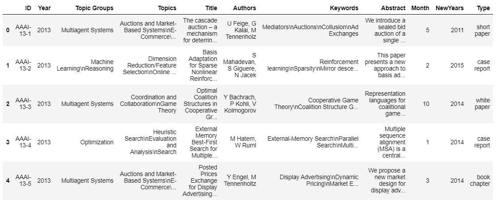

# ScientificPapers-GraphAnalytics

I prepared this story to familiarize myself Graph databases and analytics. 

The dataset used for this project consists of a list of scientific papers:

This project uses **Networkx** to create a analyze the graph database.

Checkout my medium profile where I wrote about this project.

https://medium.com/@kmacver

